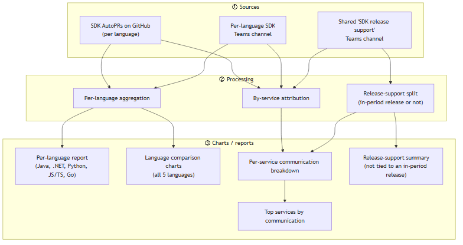
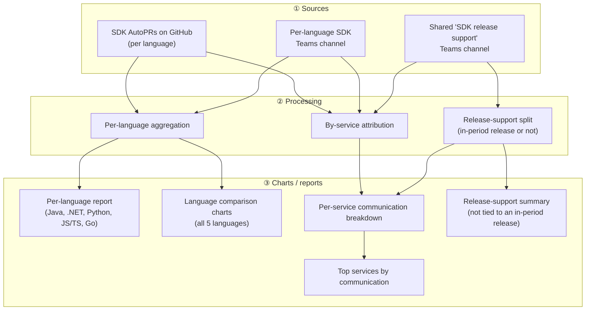

# Data flow (source → report)

High-level view of which information source each report/chart is based on.

## How to read this diagram (layout convention)

The diagram is organised as three top-to-bottom layers:

1. **Top — Sources**: raw inputs only (GitHub AutoPRs, Teams channels). Nothing is computed here.
2. **Middle — Processing**: how the raw inputs are combined/attributed (per-language aggregation, by-service attribution, release-support split).
3. **Bottom — Charts / reports**: the outputs a reader consumes.

Arrows always flow downward: **source → processing → chart**. When adding a new item, put it in the layer that matches its role and keep the arrows pointing down.

> Fallback image (for renderers without Mermaid support): [data-flow.png](./data-flow.png)

- **Sources** feed **processing**, which produces the **charts/reports** — never source → chart directly.
- Each language (Java, .NET, Python, JS/TS, Go) gets its own **per-language report**; the **comparison charts** roll all 5 together.
- **By-service attribution** folds the shared release-support channel in with the per-language data, attributing each thread to the service it concerns.
- **Release-support split** routes each release-support thread by whether it concerns a release that falls within the reporting period: threads tied to an in-period release feed the per-service breakdown; threads not tied to an in-period release go to the release-support summary.
- **Top services by communication** is derived directly from the per-service breakdown, highlighting the services with the most combined communication — the primary targets for self-serve improvement.
